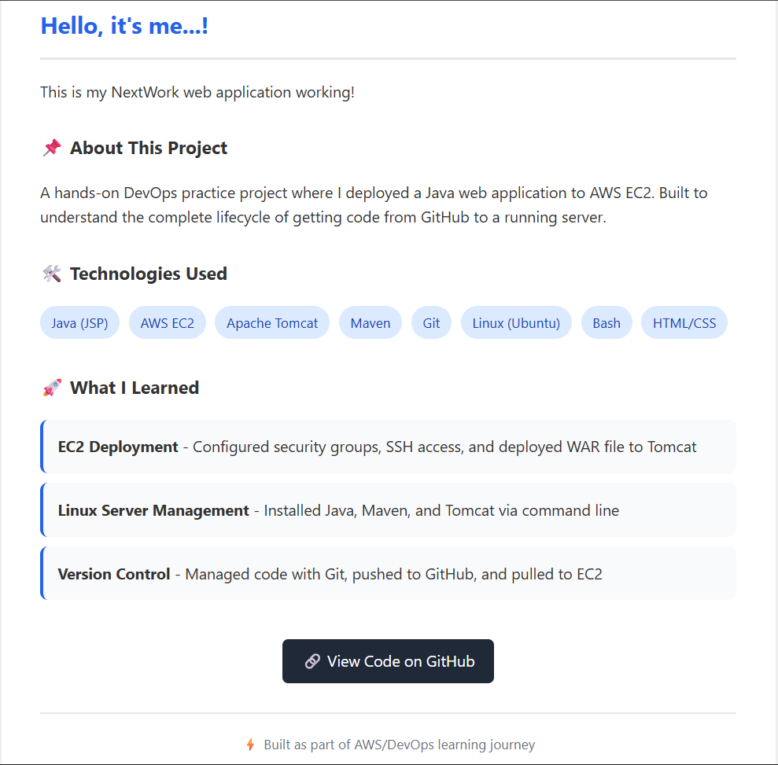
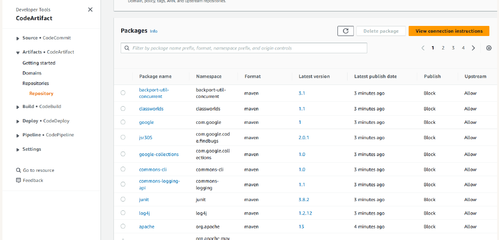
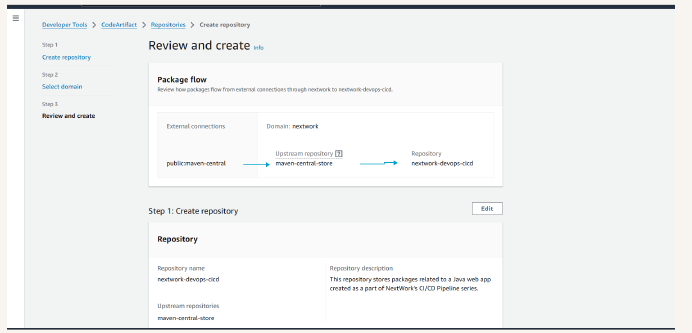
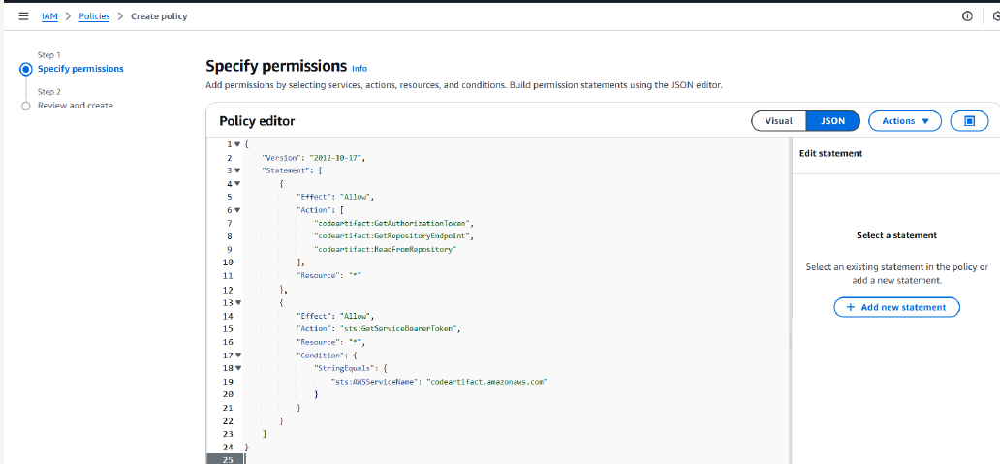

# 🔒 Java Web App with AWS CodeArtifact


A **DevOps practice project** demonstrating how to deploy a Java web application on **AWS EC2**, securely manage dependencies using **AWS CodeArtifact**, and containerize the application with **Docker**.

---

## 🚀 What This Project Shows

- Java JSP web application deployment  
- Secure Maven dependency management using **AWS CodeArtifact**  
- **IAM role configuration** for authentication  
- Build automation using **Maven**  
- **Docker containerization** for local development  
- Version control with **Git & GitHub**

---

## 🛠 Tech Stack

- Java 8 (JSP)
- Apache Tomcat
- Apache Maven
- AWS EC2
- AWS CodeArtifact
- Docker
- Linux

---

## 🐳 Run with Docker

```bash
docker build -t nextwork-webapp .
docker run -d -p 8080:8080 nextwork-webapp
```

Open in browser:

```
http://localhost:8080
```

---

## 📸 Screenshots

**Application Homepage**





*(Add screenshot here)*

---

## 📁 Project Structure

```
nextwork-web-project2
│
├── src/main/webapp
│   └── index.jsp
│
├── pom.xml
├── settings.xml
├── buildspec.yml
├── Dockerfile
└── README.md
```